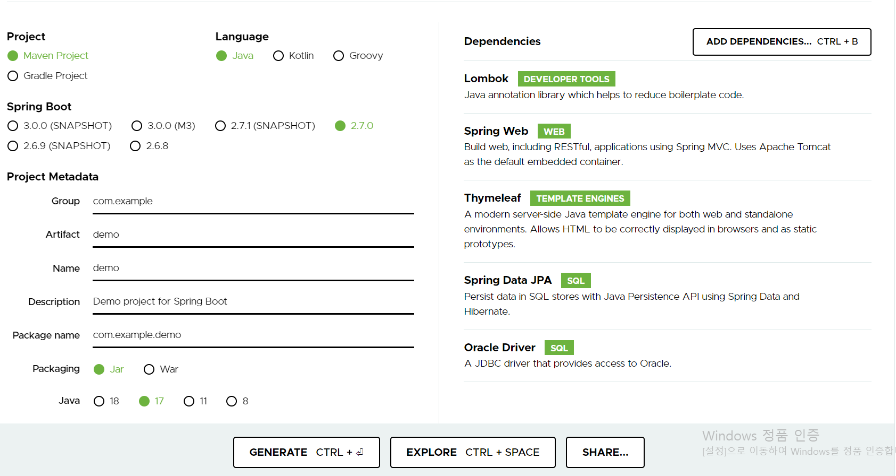

## 다른 페이지
  https://sjj02055.github.io/projects/instagram_1/
  https://sjj02055.github.io/projects/instagram_2/

## 실행 환경
  > Intellij, Oracle

## 사용 Tools
  > SpringBoot, Thymeleaf, Lombok, json-simple, JPA

### 인스타그램 - 사용환경 설정하기

## start.spring.io 이용하기



본 사이트를 이용하면 프로젝트를 만들 때, 기본 설정들을 쉽게 설정할 수 있다. 특히 dependency를 편하게 가지고 온다는 점이 너무 만족스럽다.
Lombok은 편한 어노테이션들을 제공해주기 때문에 필수
Thymeleaf 같은 경우는 인프런 김영한 강사님이 쓰라고 해서 사용했다.. 나름 쓰기 편한 것 같다.

```java
dependencies {
	implementation 'org.springframework.boot:spring-boot-starter-data-jpa'
	implementation 'org.springframework.boot:spring-boot-starter-thymeleaf'
	implementation 'org.springframework.boot:spring-boot-starter-validation'
	implementation 'org.springframework.boot:spring-boot-starter-web'
	implementation 'org.mybatis.spring.boot:mybatis-spring-boot-starter:2.1.4'
	compileOnly 'org.projectlombok:lombok'
	developmentOnly 'org.springframework.boot:spring-boot-devtools'
	runtimeOnly 'com.oracle.database.jdbc:ojdbc8'
	annotationProcessor 'org.projectlombok:lombok'
	testImplementation 'org.springframework.boot:spring-boot-starter-test'
	compile group: 'com.googlecode.json-simple', name: 'json-simple', version: '1.1.1'
	compile group: 'com.fasterxml.jackson.core', name: 'jackson-databind'
}
```
사용 한 dependency는 이정도 되는데 mybatis 같은 사용하지 않는 것도 있지만 지우기 조금 귀찮아서 패스.. 잘못 지웠다가 안 돌아갈것같다.

```java
server.port = 8100

spring.datasource.url=jdbc:oracle:thin:@localhost:1521:xe
spring.datasource.username=아이디
spring.datasource.password=번호
spring.datasource.driver-class-name=oracle.jdbc.OracleDriver

spring.jpa.hibernate.ddl-auto=none
```
다음과 같이 오라클을 설정해 줬다.
밑에 ddl-auto는
 - create: 기존테이블 삭제 후 다시 생성 (DROP + CREATE)
 - create-drop: create와 같으나 종료시점에 테이블 DROP
 - update: 변경분만 반영(운영DB에서는 사용하면 안됨)
 - validate: 엔티티와 테이블이 정상 매핑되었는지만 확인
 - none: 사용하지 않음(사실상 없는 값이지만 관례상 none이라고 한다.)
다음과 같은 옵션들이 있다. 잘 생각해서 사용해야 한다.