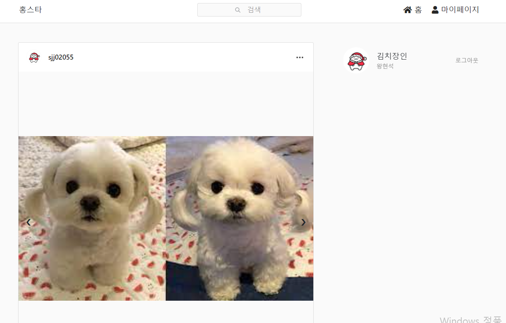

## 다른 페이지
  <https://sjj02055.github.io/projects/instagram_1/>
  <https://sjj02055.github.io/projects/instagram_2/>
  <https://sjj02055.github.io/projects/instagram_3/>

## 실행 환경
  > Intellij, Oracle

## 사용 Tools
  > SpringBoot, Thymeleaf, Lombok, json-simple, JPA

### 인스타그램 - 메인화면


메인화면은 다음과 같이 구현되어 있다. 상단의 짧은 navbar 하나와 끝 없이 내려가는 화면.. 무한스크롤로 구현하면 더 좋겠지만 일단 백엔드 위주로...!

```java
@Controller
@Slf4j
@RequiredArgsConstructor
public class HomeController {

@GetMapping("/")
    public String goHomeV2(@SessionAttribute(name= "loginMember", required = false)
                           Member loginMember, Model model, HttpServletRequest request){
        if(loginMember == null){
            return "index";
        }
        List<Follow> follow_list = followService.findByFollowerId(loginMember.getId());
        List<Post> posting = postService.findByUserIdOrderByIdDesc(loginMember.getId());

        for(Follow f : follow_list){
            List<Post> post = postService.findByUserIdOrderByIdDesc(f.getFollowing().getId());
            for(Post p : post) {
                posting.add(p);
            }
        }

        List<PoCo> replycnt = new ArrayList<>();
        for(Post po : posting){
            PoCo p = new PoCo();
            p.setPostid(po.getId());
            p.setCnt(replyService.countByPostId(po.getId()));

            replycnt.add(p);
        }

        Post p = new Post();
        Collections.sort(posting,new Post());

        model.addAttribute("p_size",posting.size());
        model.addAttribute("posting", posting);
        model.addAttribute("replycnt",replycnt);
        model.addAttribute("img", postService.findByPostid());
        model.addAttribute("member", loginMember);
        model.addAttribute("loginMember",loginMember);
        return "petmily/home";
    }
}
```

첫 줄에 만약 세션에 로그인이 되어 있지 않으면 바로 index화면으로 가지게 된다.
그러면 거기서 다시 로그인을 하고서 들어올 수 있도록 해준다.
follow_list나 positng 리스트들은 나중에 포스팅 하고.. 일단 기본 서버세팅은 이정도!

```javascript
<!DOCTYPE html>
<html xmlns:th="http://www.thymeleaf.org">
<head>
  <div th:replace="fragments/header ::header"></div>
  <title>Instagram</title>
  <link rel="stylesheet" type="text/css" th:href="@{/css/main.css}"/>
  <link rel="stylesheet" type="text/css" th:href="@{/css/common.css}"/>
  <link rel="stylesheet" type="text/css" th:href="@{/css/nav.css}"/>
  <!-- favicon -->
  <link rel="icon" href="img/favicon.png">
  <link rel="instagram-icon" href="img/favicon.png">

</head>
<body>
<!-- navigation -->
<div th:replace="fragments/navbar :: navbar"></div>
<!-- main -->
<main>
  <div th:if="${p_size==0}">
    <div class="nopost">
      <span>게시물이 없습니다.</span> <br />
    </div>
  </div>
  <div th:unless="${p_size==0}" class="feeds">
    <!-- article -->
    <article th:each="p : ${posting}">
      <header>
        <div class="profile-of-article">
          <a th:href="@{/petmily/profile/{id}(id=${p.member.id})}">
            
          </a>
          <span class="userID main-id point-span" th:text="|${p.member.userId}|">아이디</span>
        </div>
        <div class="drop">
          <div onclick="n()" class="crud-button">
            
          </div>
          <div id="crud" class="crud-content">
            <form action="/petmily/delete/" th:method="post">
              <input type="hidden" th:value="${p.id}" name="post_id">
              <button class="btn btn-submit" type="submit">삭제하기</button>
            </form>
          </div>
        </div>
      </header>
      <div class="slideshow-container">
        <div class="slide-image" th:classappend="'slide-image'+${p.id}" th:each="img : ${img}">
          <ul th:if="${img.postId == p.id}">
            
          </ul>
        </div>
        <a class="prev" th:onclick="|javascript:plusSlides(-1, ${p.id})|">&#10094;</a>
        <a class="next" th:onclick="|javascript:plusSlides(1, ${p.id})|">&#10095;</a>
      </div>
      <span class="nav-3" th:text="|${p.description}|">본문</span>
      <div th:class="icons-react" th:classappend="'icons-react'+${p.id}">
      </div>
      <div class="comment">
        <div class="container top-container">
          <div th:class="'commentList'+${p.id}"></div>
        </div>
        <div class = "container">
          <form name="commentInsertForm" th:class="'commentInsertForm'+${p.id}">
            <div class="input-group">
              <input type="hidden" name="pid" id="pid" th:value="${p.id}" />
              <input type="text" class="form-control" id="content" name="content"
                     placeholder="내용을 입력하세요.">
              <input type="hidden" name="uid" th:value="${member.getId()}" />
              <span class="input-group-btn">
					<button class="btn btn-default" th:classappend="'commentInsert' +${p.id}" type="button"
                            name="commentInsertBtn">등록</button>
				</span>
            </div>
          </form>
        </div>
      </div>
    <div class="main-right">
    <div class="myProfile">
      <a th:href="@{/petmily/profile}">
        <div th:if="${member.profile_photo == null}">
          
        </div>
        <div th:unless="${member.profile_photo == null}">
          
        </div>
      </a>
      <div>
        <a class="userID point-span" th:href="@{/petmily/profile/{id}(id=${member.getId()})}" th:text="|${member.nickname}|">사용자아이디</a>
        <span class="sub-span" th:text="|${member.name}|">이름</span>
      </div>
      <a class="sub-span" th:href="@{/member/logout}">로그아웃</a>
    </div>
  </div>
  </body>
</html>
```
제이쿼리나 ajax사용한 부분들은 다 제외하고 넣었지만 기본 틀은 이정도..!

## 후기
타임리프를 써서 서버에서 받아온 객체들을 쓰는 방식이 너무 편한 것 같다. 나중에는 타임리프 말고도 다른 것 쓰겠지..?