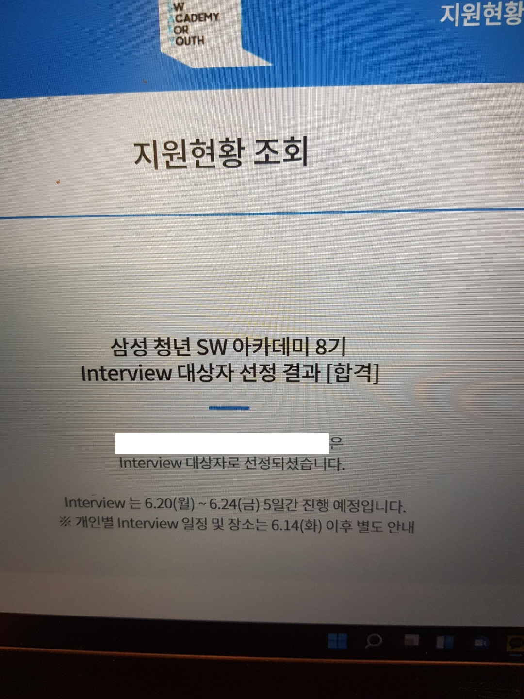

이번에는 싸피 일정이 조금 늦게 나와서 가슴 졸이느라 너무 힘들었다. 다른 기수는 다음주 에세이 제출 후 일주일만에 나오던데 8기는 거의 2주가 되서 나왔다. 물론 영업일 기준으로는 휴일이 껴있어서 7일인가.. 8일이지만 상당히 많이 기다리게 되었다. 그래도 좋은 소식이 나와서 기분은 매우 좋았다. 친구들에게 벌써부터 자랑하면 안되는데 자랑을 동네방네 하고 다닌 것 같다.

## 싸피 일정
- 지원서 접수 : 2022-05-02 ~ 2022-05-16
- 에세이 제출 : 2022-05-17 ~ 2022-05-28
- 비전공자 CT : 2022-05-21(?)
- 전공자 코테 : 2022-05-29
- 적성진단결과: 2022-06-10

## 스펙
필자의 스펙은 매우 저렴하다. 전공자인듯 전공자아닌 전공자느낌. 일단 지원서에 이렇다 할 경력 및 스펙이 없었다. 스펙 자체는 많이 안보는 것 같다. 그러니 꿈과 열정이 있다면 다들 꼭 지원해보자.
- 학교는 홍익대학교 컴퓨터공학과
- 학점 3.12/4.5
- 영어스펙 X
- 경력 X
- 졸업프로젝트 1개뿐.

## 에세이
필자의 경우는 상당히 많이 준비했다. 에세이 제출 전부터 본인 포함 4명과 함께 에세이 및 코테 스터디를 하며 준비를 했다. 서로 에세이를 읽고 나서 피드백을 해주는데 잘 썼다고 생각했으나 피드백을 받다 보면 아직도 완성본이 아니라는 느낌을 받곤 한다. 대부분의 사람들이 후일에 이 글을 볼때 에세이를 어떻게 써야 합격할까 라는 생각으로 볼 것 같은데 하나 팁을 주자면 본인의 경험을 잘 녹여내는 것이 중요한 것 같다. 다들 STAR형식으로 쓰라고 하니 그것에 대해서는 언급은 안하겠지만 "겪은경험 - 경험을 통해 배운것 - 배운 것을 통해 본인이 어떤점을 싸피에서 배우고싶은지 - 그 결과로 어떤 개발자가 되고 싶은지" 를 녹여서 썼다. 어차피 면접에 가면 본인 경험이 아니면 들통날 것이라고 생각하기 때문에 내 경험을 최대한 잘 녹여서 썼다.

## 코딩테스트
8기부터 전공자는 코딩테스트로 바뀌어서 나왔는데 어느정도 난이도로 나올지 정말 궁금했다. 삼성에서 보안을 정말 많이 생각한다고 느낀 것이 사전 OT때부터 준비를 정말 많이하고 코딩테스트 실전 날이 와도 정말 감시를 열심히 한다고 느꼈다. 몇 문제가 나오는지 몇 개를 맞춰야 합격할 수 있는지는 알려줄 수 없지만 코딩테스트를 꾸준히 해온 분이라면 무조건 컷트라인은 넘을 것이라고 생각한다. 다들 화이팅!!

## 마지막으로 남기는 꿀팁
필자는 일찍부터 오픈카톡방에 들어갔습니다. 오카방에 들어가있어서 여러가지 정보들을 많은 사람들이 알려줬습니다. 싸피만 준비하지 말고 좋은 부트캠프들도 소개해 줬습니다. 이것이 나름 마음의 위안을 제공해주기도 하더라구요. 또한, 싸피 선배분들이 해주시는 조언과 팁들을 미리 정리해둬 합격하는데 한 걸음 더 다가갈 수 있었던 것 같습니다. 합격하고 나서 말하고 싶지만 이미 받은 감사함이 더 큰 관계로 서류합격하는데 도움을 주신 저희 스터디원분들, 무사님, 파댕댕님, 싸피맛보기님 및 여러 선배분들 및 예비 동기님들 너무 감사합니다!

