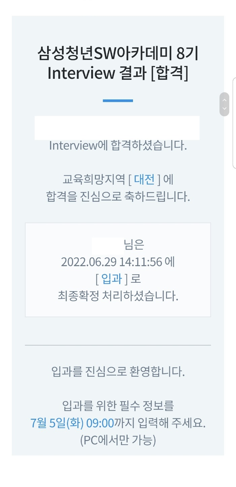

##
싸피를 준비하면서 느꼈던 점을 후기에 작성합니다.

정말 싸피를 준비하면서 밤에 잠도 못자고 두근거리고 했던 날들이 너무나도 많았습니다.
고생하셨던 8기분들 다시 한 번 너무 고생많으셨습니다.

저도 싸피를 준비하면서 수 많은 블로그에 있는 선배님들의 도움을 받았습니다. 그에 보은하고자
이렇게 글을 작성해봅니다.

## 싸피 일정
- 지원서 접수 : 2022-05-02 ~ 2022-05-16
- 에세이 제출 : 2022-05-17 ~ 2022-05-28
- 비전공자 CT : 2022-05-21(?)
- 전공자 코테 : 2022-05-29
- 적성진단결과: 2022-06-10 3pm
- 인터뷰(면접): 2022-06-20 ~ 2022-06-24
- 면접 결과   : 2022-06-29 3pm

## 면접 준비
사실 저는 면접 준비도 정말 오래했습니다. 면접 준비중에 도움 주신 싸피맛보기님(7기), 파댕댕님(7기), 갓머신호위무사님(5기) 를 비롯한 많은 선배님들, 또한 같이 면접스터디를 한 동기님들에게 다시 한 번 감사드립니다. 면접 질문들은 진짜 다른 것 필요 없습니다. 그냥 시중에 떠돌아다니는 면접 질문들 다 질문에 답할 수 있으면 됩니다. 또한, 오카방에서 면접스터디 꼭꼭하세요!! 면접스터디가 제일 중요하답니다.

저는 면접 질문 준비리스트 같은 것은 올리지 않고 면접을 어떻게 보아야 하는지 알려드리겠습니다.

1. 두괄식으로 답해라
면접에 있어서 제일 중요한 것이 인상을 남기는 것입니다.
면접관님이 여러분에게 왜 싸피하고싶어요? 같은 단순한 말을 했을 때, 저는 이러한 경험이 있었습니다. 이 과정에서 블라블라 하는 말보다는 저는 ~~한 이유 때문에 싸피를 하고 싶습니다. 왜냐하면 ~ 라는 방식이 면접관님 머리속에 정리가 더 잘 될 것 같습니다. 면접관님을 난해하게 만들지 마세요. 정리해서 답해주세요(물론 저는 매우떨어서 난해하게 말했씁니다....)

2. 기술 쓴 것들 절대 나열하지 마세요
기술 쓴 것들을 말하게 되면 그거에 대한 꼬리질문이 달릴텐데 그거에 대한 답을 못하면 정말 난처해집니다. 물론 본인이 진행한 프로젝트에 대해 이해도가 높으면 그 프로젝트에 대해 얘기할 수 있으면 좋습니다. 하지만 너무 많이 아는 것 같으면 교육생으로서 가치가 없습니다. 이곳은 교육의 장이지 취업하는 곳이 아닙니다. 너무 아는 티 많이 내시면 안돼요.

## 면접 후기
제가 면접을 본 날은 비가 추적추적 오던 23일날 목요일이었습니다.
수 많은 정장(50%)과 나머지 세미정장(35%) + 캐쥬얼(15%)로 입고 오신 분들과 역삼 멀티캠퍼스에서 준비했습니다.
선배님들 말을 들어보면 2시간이 후딱 가버린다고 하는데 왜 2시간이 후딱 가버리는지 면접보고나면 알게됩니다.

일단 23일날의 시간 순서대로 말씀 드리겠습니다.
23일날 아침 면접이다보니 혹시라도 못일어날까봐 어머니한테 말씀드리고 누웠지만, 밤새 열대야 + 걱정때문에 잠을 설치고
3시부터 짧게 6시까지 3시간잤습니다.
아침 일찍 면접이다 보니 준비하고 나와서 바로 역삼 옆에 있는 바나프레소에서 오늘의 커피(?)를 마셨습니다. 그리고 1분자기소개를 달달달 외우고 있었습니다.
그리고 어느정도 지난뒤에 제 시간이 되서 멀티캠퍼스에 들어갔습니다. 삼성에서 주최를 하다보니 확실히 코로나 방역에 대해서 신경쓰는 모습이 보였습니다. 손에 뭐 뿌리고 온도 체크하고.. 삼성 짱입니다.
일단 면접내용은 대외비니까 아무 말씀 안드리겠습니다.

면접 끝나고 든 생각은 '너무 후련하다' 였습니다. 정말 4월말부터 에세이스터디부터 해서 많이 준비했었고 그 과정이 끝나니까 이루 말할 수 없을 정도로 뿌듯했었습니다. 집에 오자마자 바로 못 잤던 잠을 자고(에어컨 빵빵하게) 쉬었습니다.
아니나 다를까 오카방은 터질듯이 올라오고.. 저는.. 나름대로 오카방 네임드(?)기때문에 열심히 얘기하고 놀았습니다.

근데 끝나고 난 후에 여러가지 질문을 곱씹는중에 아 내가 왜 그렇게 말했지? 아 답변 잘못 드렸다라고 생각한 것들이 너무나도 많았습니다. 진짜 이것때문에 밤에 잠이 며칠동안 안오고 스트레스가 장난아니었습니다. 후우...
물론, 저는 워낙 말이 많은 스타일이라 면접관님이 물어보셨을 때, 모든 답을 하긴 했습니다. 물론 어떤 것은 정답이었고 정답이 아닐지도 모르겠습니다. 하지만 제가 준비했던 답을 모두 하지 못했고 완벽하지 않았다고 생각했습니다. 그래서 후회가 많이 남았습니다.

원래는 6월30일에 결과가 나올 것 같아서 약속의 목요일 하면서 기다리고 있었는데(사실 수요일 3시에 싸피 홈페이지 켜놨습니다..) 갑자기 결과발표창이 떴습니다.. 저는 떨어질것같다고 생각해서 슈뢰딩거의 고냥이 마냥 "내가 이것을 열지않는다면 나는 붙어있을거야. 하지만 이것을 열면 난 떨어지겠지" 라는 생각을 가지고 단톡방 사람들이랑 더 놀고싶었습니다. 한 15분 지나고 못참겠어서 그냥 열었습니다. 하지만 이게 웬걸!!

1지망 서울 2지망 대전이었는데 대전에 붙어버렸습니다. 원래 자취 너무 해보고싶어서 이 기회에 부모님에게 자취하겠다고 말씀드렸습니다. 내일 방보러 대전에 갈건데 너무나도 설렙니다. 후일에 이 글을 보게될 9기 및 후배님들 저도 면접 잘 못봤지만 붙었으니 너무 걱정하지마세요. 다 잘될 겁니다. 혹시라도 궁금한점이 있으면... 오카방에서 모코코를 찾아주세요. 성실하게 답해드리겠습니다.